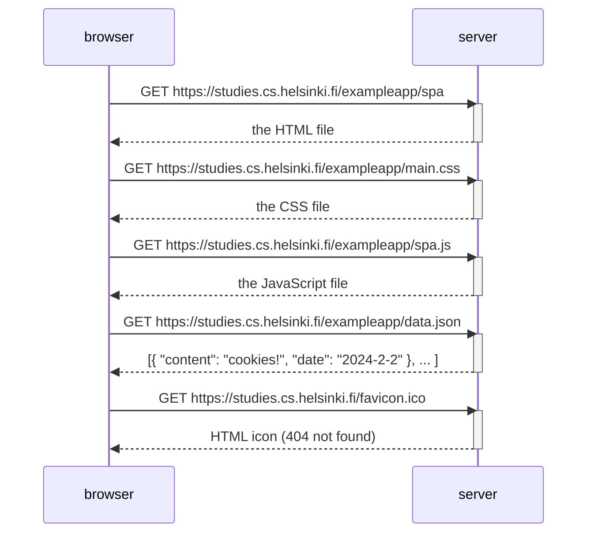

```mermaid
sequenceDiagram
        participant browser
        participant server

        browser->>server: GET https://studies.cs.helsinki.fi/exampleapp/spa
        activate server
        server-->>browser: the HTML file
        deactivate server

        browser->>server: GET https://studies.cs.helsinki.fi/exampleapp/main.css
        activate server
        server-->>browser: the CSS file
        deactivate server
        
        browser->>server: GET https://studies.cs.helsinki.fi/exampleapp/spa.js
        activate server
        server-->>browser: the JavaScript file
        deactivate server
        
        browser->>server: GET https://studies.cs.helsinki.fi/exampleapp/data.json
        activate server
        server-->>browser: [{ "content": "cookies!", "date": "2024-2-2" }, ... ]
        deactivate server

        browser->>server: GET https://studies.cs.helsinki.fi/favicon.ico
        activate server
        server-->>browser: HTML icon (404 not found)
        deactivate server    

```